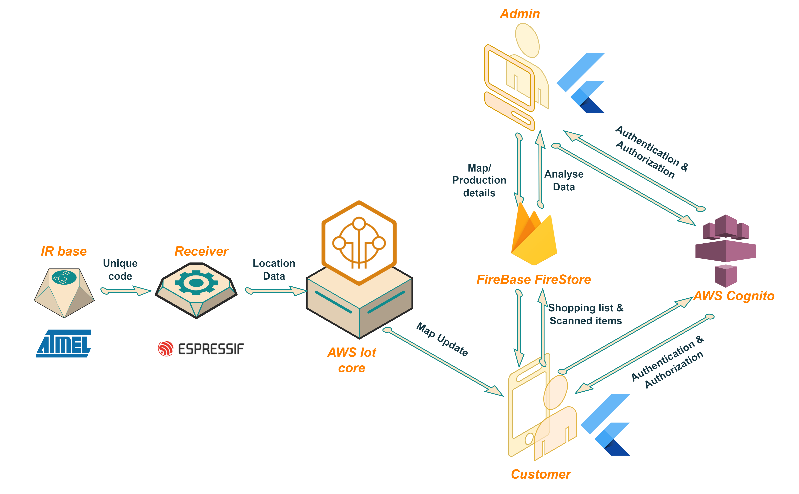

[comment]: # "This is the standard layout for the project, but you can clean this and use your own template"

<!-- # Smart Supermarket Navigation System -->

---

## Team
-  E/19/017, W.A.S. Amanda, [e19017@eng.pdn.ac.lk](mailto:e19017@eng.pdn.ac.lk)
-  E/19/057, C.O. Colombage, [e19057@eng.pdn.ac.lk](mailto:e19057@eng.pdn.ac.lk)
-  E/19/210, R.P.J.R. Kumarasiri, [e19210@eng.pdn.ac.lk](mailto:e19210@eng.pdn.ac.lk)
-  E/19/409, D.P. Udugamsooriya, [e19409@eng.pdn.ac.lk](mailto:e19409@eng.pdn.ac.lk)
-  E/19/413, G.G.N. Viduranga, [e19413@eng.pdn.ac.lk](mailto:e19413@eng.pdn.ac.lk)

<!-- Image (photo/drawing of the final hardware) should be here -->

<!-- This is a sample image, to show how to add images to your page. To learn more options, please refer [this](https://projects.ce.pdn.ac.lk/docs/faq/how-to-add-an-image/) -->

<!--  -->

#### Table of Contents
1. [Introduction](#introduction)
2. [Solution Architecture](#solution-architecture )
3. [Hardware & Software Designs](#hardware-and-software-designs)
4. [Testing](#testing)
5. [Detailed budget](#detailed-budget)
6. [Conclusion](#conclusion)
7. [Links](#links)

## Introduction

In this project we hope to develop an indoor navigation system for supermarkets, 
aimed at enhancing the shopping experience of customers while providing valuable insights for the shop 
owners

## Solution Architecture

The solution architecture of our smart indoor navigation system is designed to provide efficient navigation and real-time tracking for customers within a premises. It utilizes IR bases and IR receivers as the primary hardware components and relies on Firebase as the underlying technology, with the Firebase Realtime Database serving as the main database. The system caters to two main user groups: administrators and customers. Administrators have the ability to update map data, prices, and other relevant information, while customers can utilize the system to locate products on their shopping lists and receive real-time tracking updates. Additionally, the solution architecture utilizes the HTTP protocol for data transmission, ensuring secure communication between the different components.
 
 

<!-- High level diagram + description -->

## Hardware and Software Designs

Cart Design
 
 

 
 
Schematic Designs
 
 

Base Stations
 
 

Cart Module
 
 

<!-- Detailed designs with many sub-sections -->

## Testing

In the realm of Flutter testing, unit testing involves scrutinizing isolated functions or methods to verify their correctness and functionality. As an example, we perform unit testing on the ShopWise app by meticulously testing the function responsible for adding items to the grocery list, ensuring accurate and reliable outcomes. Moving to widget testing, the focus shifts to examining the interaction and behavior of individual UI components. In the context of our ShopWise app, widget testing would involve assessing the seamless integration of a text input field and a button used to add a grocery item, ensuring a user-friendly and glitch-free experience. Lastly, integrated testing provides a holistic evaluation by scrutinizing the application as a whole, and simulating real-world scenarios. Taking our ShopWise app example, integrated testing could involve running the app on an emulator and systematically testing all related functionalities, from item addition to the overall user interface, to ensure a robust and cohesive user experience.
 
 

<!-- Testing done on hardware and software, detailed + summarized results -->

## Detailed budget

<!-- All items and costs

| Item          | Quantity  | Unit Cost  | Total  |
| ------------- |:---------:|:----------:|-------:|
| Sample item   | 5         | 10 LKR     | 50 LKR | -->

<!-- What was achieved, future developments, commercialization plans -->

## Links

- [Project Repository](https://github.com/cepdnaclk/{{ page.repository-name }}){:target="_blank"}
- [Project Page](https://cepdnaclk.github.io/{{ page.repository-name}}){:target="_blank"}
- [Department of Computer Engineering](http://www.ce.pdn.ac.lk/)
- [University of Peradeniya](https://eng.pdn.ac.lk/)

[//]: # (Please refer this to learn more about Markdown syntax)
[//]: # (https://github.com/adam-p/markdown-here/wiki/Markdown-Cheatsheet)
